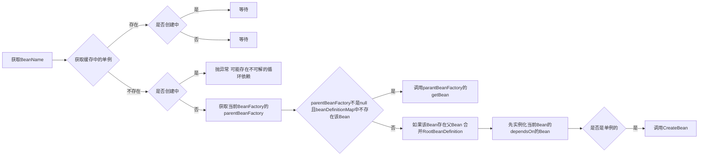

    使用流程图，说明以及代码的形式来说明整个声明周期的流程。注意因为代码比较多，这里的流程图只画出了大概的流程，具体的可以深入代码

```mermaid
graph LR
    A[获取BeanName] --> B{获取缓存中的单例}
    B -->|存在| C{是否创建中}
    C -->|是| D[等待]
    C -->|否| E[等待]
    B -->|不存在| F{是否创建中}
    F -->|是| G[抛异常 可能存在不可解的循环依赖]
    F -->|否| H[获取当前BeanFactory的parentBeanFactory]
    H --> I{parentBeanFactory不是null 且beanDefinitionMap中不存在该Bean}
    I -->|是| J[调用parantBeanFactory的getBean]
    I -->|否| K[如果该Bean存在父Bean 合并RootBeanDefinition]
    K --> L[先实例化当前Bean的dependsOn的Bean]
    L --> M{是否是单例的}
    M -->|是| N[调用CreateBean]
```

---
作者：撸码识途
链接：https://www.jianshu.com/p/70b935f2b3fe
来源：简书
著作权归作者所有。商业转载请联系作者获得授权，非商业转载请注明出处。